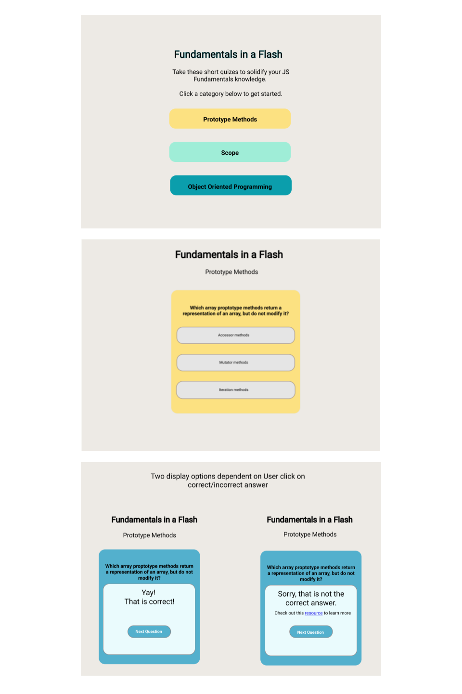

# Fundamentals In A Flash

### Abstract:
The goal of this project was to create a study tool for students that focuses on a technical topic. I decided to create a quiz application where users can test their knowledge on JavaScript fundamentals. As a user answers questions correctly they can choose to continue test their knowledge on those questions or only on the questions they have yet to master.
### Set-Up Frontend:
Clone this repo  
Run `npm install` from the root directory  
Run `npm start` and visit localhost:3000 in your browser
### Preview:

### Primary Technologies Used:
* React
* JavaScript
* CSS/SCSS
### Testing:
Jest and Enzyme for front-end testing  
Run `npm test` from the root directory
### Original Assignment: 
[Memoize](http://frontend.turing.io/projects/memoize.html) project from Turing School of Software and Design
### Wireframes:

